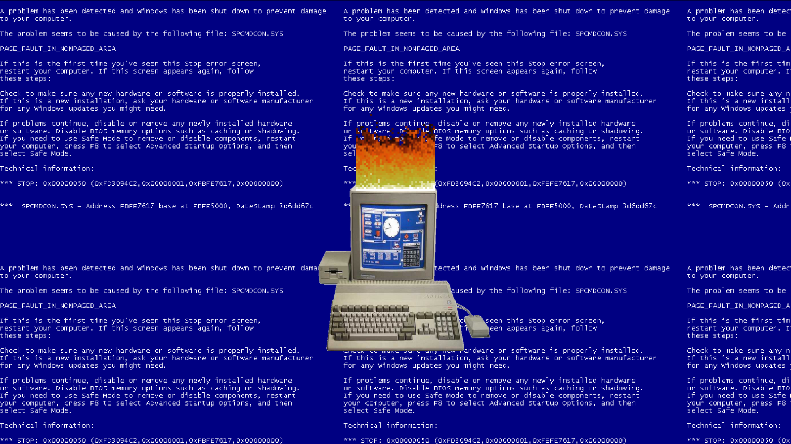

# Doom Fire
<h1 align="center">
    
    <h4>O mais famoso fogo pixelado, diretamente das profundesas dos infernos de DOOM</h4>
</h1>

<h4 align="center"> 
	🚧 DOOM Fire 1.0 - sempre em construção... 🚧
</h4>

<p align="center">
  

  
  
  <a href="https://github.com/AngeloLanch/DOOM_Fire/commits/master">
    
  </a>

  
</p>


## 💻 Sobre o projeto

DOOM Fire é um projeto que nasceu no canal FelipeDeschamps no Youtube, foi um desafio proposto e conduzido pelo Felipe para desenvolvedores iniciantes praticarem os conceitos bases da programação Web.
Ao rodar a aplicação, todo o estilo anos 90 sera invocado diretamente na sua tela.

## 🎨 Layout

A temática foi escolhida por mim para relembrar meus tempos de garoto, foi a dos antigos PCs de tubo, em que eu sofria no Windows97

### Mobile Screens

<p align="center">
  
</p>

## 🛠 Tecnologias

As seguintes ferramentas foram usadas na construção do projeto:
- [HTML][html]
- [CSS][css]
- [JavaScript][js]

## :calling: Como executar o projeto

Este é um projeto inteiramente front-end!

### Pré-requisitos

Antes de começar, você vai precisar clonar o repositório.

Além disto é bom ter um editor para trabalhar com o código como [VSCode][vscode]

### :cat: Clonando o Repositório

```bash
# Clone este repositório
$ git clone https://github.com/AngeloLanch/DOOM_Fire
            
# Acesse a pasta do projeto no terminal/cmd
$ cd DOOM_Fire

```

### :repeat: Rodando a aplicação

Para ver a chama queimar, basta abrir o arquivo index.HTML on seu navegador

## :raising_hand: Para contribuir com o projeto

1. Faça um **fork** do projeto.
2. Crie uma nova branch com as suas alterações: `git checkout -b my-feature`
3. Salve as alterações e crie uma mensagem de commit contando o que você fez: `git commit -m "feature: My new feature"`
4. Envie as suas alterações: `git push origin my-feature`
> Caso tenha alguma dúvida confira este [guia de como contribuir no GitHub](https://github.com/firstcontributions/first-contributions)

## 📝 Licença

Feito por: Ângelo Lanche.
Este projeto está sobe a licença MIT.

Este foi um projeto desenvolvido para praticar o básico da programação front-end Web.
[Entre em contato!](https://www.linkedin.com/in/AngeloLanch/)

[html]: https://html.spec.whatwg.org/multipage/
[css]: https://www.w3.org/Style/CSS/specs.en.html
[js]: https://developer.mozilla.org/pt-BR/docs/Web/JavaScript
[vscode]: https://code.visualstudio.com/
[vceditconfig]: https://marketplace.visualstudio.com/items?itemName=EditorConfig.EditorConfig
[license]: https://opensource.org/licenses/MIT